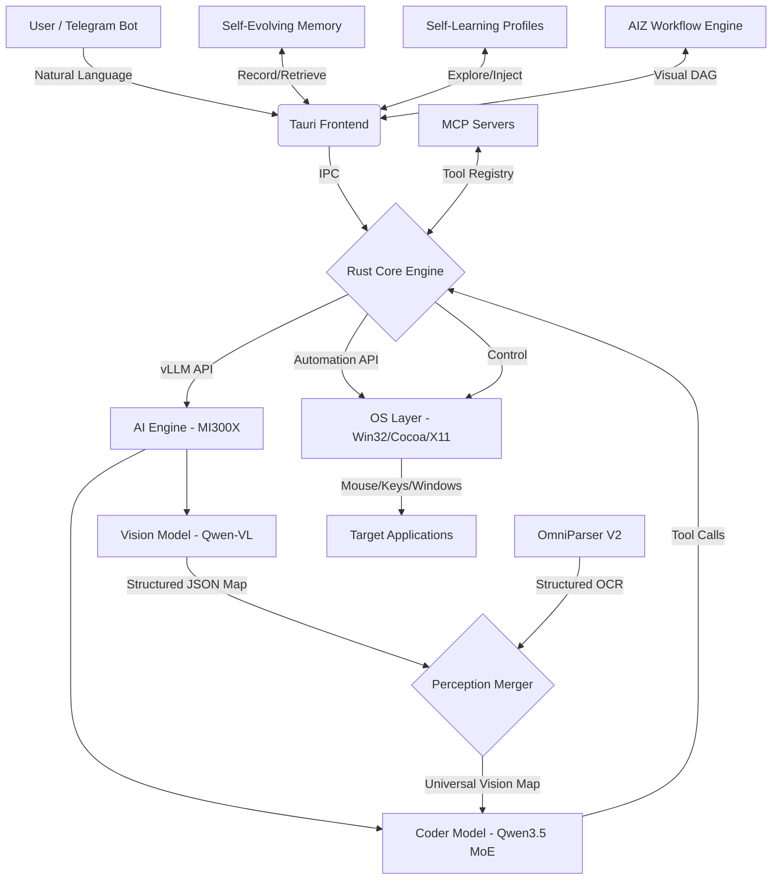

# 🐾 Catog Automation

### The Self-Evolving AI Desktop Orchestration Framework


> [!IMPORTANT]
> **Catog Automation** is a high-performance, cross-platform desktop automation framework built with **Rust + Tauri 2**. It enables autonomous AI agents to **see**, **learn**, **remember**, and **improve** — interacting with any application through natural language, real-time visual grounding, and direct OS-level manipulation. Powered by dual-model orchestration (Vision + Coder) running locally on AMD MI300X GPUs via vLLM.

---

## 🧬 What Makes Catog Different

Unlike conventional desktop automation tools that follow static scripts, Catog is a **living, evolving agent** that gets smarter with every task:

| Capability | Description |
|---|---|
| **Self-Evolving Engine** | Records successful step sequences, classifies tasks by type, and injects proven context into future runs — powered by a Karpathy-inspired ratchet pattern with human-graded reinforcement |
| **Self-Learning Explore Tool** | Autonomously navigates programs to build persistent "program profiles" — cataloguing every button, menu, shortcut, and control purpose for future reference |
| **Dual-Model Vision Pipeline** | Vision model (Qwen-VL) **sees** the screen and extracts a structured coordinate map; Coder model (Qwen3.5-35B MoE) **decides** and emits tool calls — each model does what it does best |
| **OmniParser Fusion** | Runs Microsoft OmniParser V2 in parallel with the vision model for structured OCR + element detection, merging both signals into a unified perception map |
| **Fully Local & Private** | All inference runs on your own GPU — no cloud API keys, no data leaving your machine |

---

## 🚀 Key Features

### 🧠 Self-Evolving Engine (Karpathy Auto-Research Pattern)

The core intelligence system that makes Catog get better over time:

- **Step Recording**: Every tool call during a task (click, type, hotkey, etc.) is recorded with arguments, results, and success/failure status
- **Task Classification**: User requests are automatically categorized by action-object pairs (e.g., `open_browser`, `type_document`, `search_chrome`) for efficient retrieval
- **Proven Context Injection**: When a new task matches a previously successful category, the best-performing step sequence is injected into the AI's system prompt as guidance
- **Human-in-the-Loop Grading**: After each task, the user grades it as ✅ Correct or ❌ Incorrect — only correct runs enter memory, preventing error propagation
- **Ratchet Mechanism**: Memory is pruned to keep only the top-performing sequences per category, with configurable limits (50 categories × 5 sequences × 20 steps)
- **2-Sentence UI Summarizer**: Captures a screenshot and generates exactly 2 sentences describing the current screen state, keeping context lightweight for the AI
- **Live Dashboard**: Real-time UI showing memory count, success rate, steps learned, and a ratchet log of all commits/reverts

### 🔭 Self-Learning Explore Tool

An autonomous program exploration system that builds persistent knowledge:

- **Automated Navigation**: Launches a target program and systematically opens every menu, tab, ribbon, and panel using vision-guided actions
- **Control Cataloguing**: After navigation, asks the vision model to enumerate every visible control with its **function** — not just its name, but what clicking it actually does
- **Persistent Profiles**: Stores program profiles keyed by name in localStorage, with deduplication and merge logic for incremental exploration
- **Profile Injection**: When a user task mentions a known program (e.g., "open Chrome and search..."), the profile is automatically injected into the coder's prompt with all known controls and shortcuts
- **Configurable Iterations**: Control how many exploration iterations the agent performs (5–60 cycles per program)

### 👁️ Vision-Guided Agent (Dual-Model Pipeline)

The primary automation engine — a perception-action loop:

```
┌─────────────────────────────────────────────────────────────┐
│  Per Iteration:                                             │
│  1. Capture Screen (hide Catog window, screenshot, restore) │
│  2. Vision Model → Structured JSON coordinate map           │
│  3. (Optional) OmniParser → Parallel structured OCR         │
│  4. Merge both signals into Universal Vision Map            │
│  5. Coder Model → 1-3 tool calls (click, type, hotkey...)  │
│  6. Execute tool calls on desktop                           │
│  7. Repeat until TASK_DONE or max iterations                │
└─────────────────────────────────────────────────────────────┘
```

**Vision Map Structure** — exhaustive extraction from the active window:
- `tools[]` — Every interactive control (buttons, tabs, menus, toolbar icons, inputs, checkboxes, dropdowns, sliders) with pixel coordinates
- `text_blocks[]` — Every static text region (headings, paragraphs, labels, status bars) with bounding boxes
- `sentences[]` — Paragraph-level text split into individual sentences
- `words[]` — OCR-level granularity — every visible word with its bounding box
- `columns[]` / `rows[]` — Table, grid, and list view structure with cell text
- `window` — Active window bounds and focus state
- `omniparser` — OmniParser element overlay (when enabled)

**Robustness features:**
- 3-retry vision API calls with exponential backoff
- JSON extraction with 4 fallback strategies (code blocks → balanced brace matching → cleanup → key-value regex)
- Vision self-repair pass (asks model to reformat its own malformed output)
- Coder-assisted JSON normalization as a salvage path
- Bootstrap tools injected when vision map is sparse (window center, content center clicks)
- Smart task-type detection to skip vision snapshots for non-automation chat

### 🔗 OmniParser V2 Integration (Structured OCR)

Optional parallel OCR pipeline using Microsoft's OmniParser:

- **Parallel Execution**: Runs simultaneously with the vision model on the same screenshot frame — zero additional latency
- **Multi-Format Tolerance**: Handles Gradio, REST, and raw array response formats automatically
- **Normalized Output**: Converts all response shapes into a unified `{label, type, content, x, y, bbox}` format
- **Graceful Fallback**: OmniParser failures never block the main pipeline — vision map continues alone
- **AMD ROCm Optimized**: Runs on Florence-2 + YOLOv8 with ROCm-specific PyTorch and flash_attn bypass

### 🎮 Desktop Automation Tools

Pixel-perfect OS-level control via Rust (Tauri IPC → native APIs):

| Tool | Description |
|---|---|
| `click_at` | Click at exact screen coordinates |
| `long_press_at` | Hold-click for context menus and drag initiation |
| `double_click_at` | Double-click at coordinates |
| `right_click_at` | Right-click for context menus |
| `type_text` | Type text at current cursor (supports `\n` for Enter) |
| `press_key_combo` | Key combos: `ctrl+c`, `command+l`, `alt+f4`, etc. |
| `scroll_at` | Scroll at coordinates (up/down/left/right) |
| `drag` | Drag from point A to point B with configurable duration |
| `screenshot` | Capture full screen or region as base64 PNG |
| `get_screen_size` | Get screen resolution |
| `launch_application` | Launch app by name |
| `activate_application` | Bring app to foreground/focus |
| `get_running_programs` | List running programs with PIDs and window titles |
| `get_installed_applications` | List all installed applications |
| `get_active_window_bounds` | Get focused window position and dimensions |
| `get_active_window_edges` | Get window edge midpoints for drag-resize |
| `window_control_action` | Maximize, minimize, close, restore windows |
| `resize_window` / `move_window` | Programmatic window manipulation |
| `clipboard_read` / `clipboard_write` | Read/write system clipboard |
| `wait_ms` | Delay execution (100–30,000 ms) |

### 📊 AIZ Visual Workflow Builder

A node-based visual programming system for complex automation:

- **Drag-and-Drop Canvas**: Build workflows by placing and connecting nodes visually
- **Built-in Node Types**: Vision nodes, coder nodes, tool call nodes, conditional nodes, and custom code nodes
- **Run Modes**: Execute workflows in **Once**, **Loop** (continuous), **Parallel** (concurrent), or **Multiple** (N-times) modes
- **Custom Node Types**: Create reusable node types with configurable fields, custom execution code, and validation
- **Code Validation**: Sandboxed execution testing with mock APIs before deployment
- **Workflow Library**: Save, load, import, and manage workflow collections
- **Isolated Execution Contexts**: Each workflow runs in its own context with independent stop signals
- **Play All**: Batch-execute multiple saved workflows sequentially

### 🔌 MCP Server Integration (Model Context Protocol)

Extensible tool system via the Model Context Protocol:

- **Dynamic Server Management**: Add MCP servers via JSON config (command, args, environment variables)
- **Live Tool Registry**: Connected servers expose their tools to the AI agent automatically
- **System Prompt Injection**: MCP tools are listed in the agent's system prompt with descriptions, enabling natural language invocation
- **Server-Routed Calls**: Tool calls include a `server` field for precise routing to the correct MCP backend
- **Desktop Commander & Chrome MCP**: Pre-configured support for desktop control and browser automation servers

### 💬 Chat & Session Management

Full-featured conversational interface:

- **Multi-Session Support**: Create, switch, rename, and delete independent chat sessions
- **Persistent History**: All sessions with full message history saved to localStorage
- **Auto-Titling**: Sessions automatically named from the first user message
- **Streaming Responses**: Real-time token streaming from the coder model with live Markdown rendering
- **Markdown Rendering**: Full support for headings, bold/italic, code blocks, inline code, links, lists
- **Thinking Block Stripping**: Automatically strips `<think>`, `<reasoning>`, and other CoT blocks from model output
- **Stop/Abort**: Cancel in-progress generation at any time
- **Auto-Scroll**: Smart scroll-sticking that stays at bottom during generation but respects manual scroll-up

### 🤖 Skill System (Import / Export)

Reusable automation recipes:

- **Skill Library**: Save named skills (prompt templates) that the agent can execute on demand
- **Chat Skills**: Natural language prompts that trigger multi-step desktop automation
- **Workflow Skills**: Skills linked to AIZ workflows for visual automation execution
- **Import/Export**: Share skills as JSON files with drag-and-drop import and format validation
- **System Prompt Integration**: Saved skills are listed in the AI's system prompt so it can match and execute them by name

### 📱 Telegram Bot Integration

Remote control and notification system:

- **Bot Token & Chat ID Configuration**: Connect any Telegram bot for bidirectional communication
- **Message Polling**: Polls for incoming Telegram messages and routes them to the AI agent
- **Send Messages**: Agent can send Telegram messages via `telegram_send_message` tool call
- **Enable/Disable Toggle**: Turn Telegram integration on/off without losing configuration
- **Status Display**: Live connection status in the UI

### 🖥️ Embedded Terminal

Full-featured terminal emulator built into the application:

- **xterm.js Integration**: Real terminal with ANSI color support, scrollback, and cursor control
- **Streaming Execution**: Real-time output via Tauri events (`command-output`, `command-status`)
- **Cross-Platform Shells**: PowerShell (Windows), zsh (macOS), bash (Linux) — auto-detected
- **Command Cancellation**: Cancel running commands with timeout protection
- **Multiple Commands**: Track and manage multiple concurrent streaming commands

### 📁 Codex-Inspired File Operations

9 file tools + 4 terminal tools designed for AI agent background operations:

- **read_file** — Line-range reading for efficient partial reads
- **write_file** — Atomic writes (temp file → rename) with auto parent directory creation
- **list_files** — Recursive directory listing with pattern filtering
- **search_files** — Regex-based grep with file pattern filtering and result limits
- **create_directory** / **delete_path** / **move_path** / **copy_path** / **file_exists**
- **AI Tool Discovery** — `list_agent_tools`, `get_agent_tool`, `list_agent_tool_categories` for runtime tool introspection

### ⚡ Performance Optimized

- **AMD MI300X Native**: Deeply optimized for AMD MI300X GPUs (192GB VRAM) using ROCm and vLLM
- **MXFP4 Quantization**: Runs the 35B-parameter MoE coder model at extreme speed with Quark quantization
- **MTP Speculative Decoding**: Speculative parallel token generation for real-time responses
- **FP8 KV Cache**: Memory-efficient attention caching across both models
- **Expert Parallel**: Mixture-of-Experts routing with parallel expert execution
- **Chunked Prefill**: Efficient prompt processing for long context windows
- **Rust Core**: Near-zero overhead system interactions via Tauri's Rust backend
- **Smart VRAM Allocation**: Vision model at 15% (~29GB) + Coder at 55% (~106GB) = ~70% utilization with headroom

### 🛡️ Security & Safety

- **Audit Logging**: Every action taken by the agent is logged with timestamps
- **App Whitelisting/Blacklisting**: Restrict or block specific applications
- **Manual Confirmation**: Optional "Human-in-the-loop" mode for sensitive actions
- **Sequence Validation**: Configurable maximum sequence length and action validation
- **Input Sanitization**: Large binary data and secrets stripped from memory storage
- **Self-Hiding**: Catog window auto-hides during screenshots to prevent self-reference loops

---

## 🏗️ Architecture



### Rust Backend Modules

| Module | Purpose |
|---|---|
| `desktop_automation.rs` | Core OS automation (103KB) — screen capture, input simulation, window management |
| `windows_agent.rs` | Windows-specific Win32 API bindings and UI Automation |
| `mcp_servers.rs` | MCP server lifecycle management and tool routing |
| `file_ops.rs` | Codex-inspired file operations with atomic writes |
| `terminal_exec.rs` | Streaming terminal execution with cancellation |
| `agent_tools.rs` | AI tool discovery and JSON schema system |
| `ai_agent/` | Cross-platform traits, NLP parser, learning system, security |

### Frontend Architecture

| File | Purpose |
|---|---|
| `main.ts` (6,700+ lines) | Complete application logic — Self-Evolving Engine, Self-Learning, Vision Agent, AIZ Workflow Builder, Chat, MCP, Telegram, Skill system |
| `automation-agent.ts` | TypeScript API wrapper for Windows Agent with fluent sequence builder |
| `index.html` | Full application UI with sidebar, chat, settings panels, workflow canvas |
| `styles.css` | Complete styling with dark theme, neon accents, animations |

---

## 🛠️ Getting Started

### Prerequisites
- **OS**: Windows 10+, macOS 13+, or Linux (Ubuntu 22+)
- **Rust**: 1.75+
- **Node.js**: 20+
- **Hardware**: AMD MI300X recommended for optimal performance (also works with NVIDIA GPUs or CPU-only mode with external API endpoints)

### Installation

1. **Clone the repository**
   ```bash
   git clone https://github.com/Zrald1/catog-automation.git
   cd catog-automation
   ```

2. **Install dependencies**
   ```bash
   npm install
   ```

3. **Start Development Mode**
   ```bash
   npm run tauri dev
   ```

---

## 🤖 AI Backend Setup (AMD MI300X Optimized)

Catog Automation is designed for extreme-speed dual-model orchestration. Use the following optimized deployment script to launch your backend:

```bash
#!/bin/bash

# --- Global Optimizations for MI300X (192GB VRAM) ---
export HF_TOKEN="<YOUR_HF_ACCESS_TOKEN>"
export VLLM_SLEEP_WHEN_IDLE=1
export VLLM_USE_DEEP_GEMM=0
export VLLM_USE_FLASHINFER_MOE_FP16=1
export VLLM_USE_FLASHINFER_SAMPLER=0
export VLLM_ROCM_USE_AITER=1
export VLLM_ROCM_USE_AITER_FP4BMM=0
export HIP_FORCE_DEV_KERNARG=1
export OMP_NUM_THREADS=4

# --- Instance 1: Vision Assistant (Real-Time GUI Grounding) ---
# Utilizing 0.15 (~28.8GB VRAM)
echo "Starting Real-Time Vision Assistant on Port 8000..."
OMP_NUM_THREADS=1 vllm serve Qwen/Qwen3-VL-2B-Instruct \
    --host 0.0.0.0 \
    --port 8000 \
    --dtype bfloat16 \
    --gpu-memory-utilization 0.15 \
    --max-model-len 32768 \
    --kv-cache-dtype fp8 \
    --limit-mm-per-prompt '{"image": 2}' \
    --mm-processor-cache-gb 4 \
    --trust-remote-code &

# Wait for vision model to initialize
sleep 30

# --- Instance 2: Extreme Speed Coding Flagship ---
# Utilizing 0.55 (~106GB VRAM) | Total VRAM usage: ~70%
echo "Starting Extreme Speed Coder on Port 30000..."
vllm serve amd/Qwen3.5-35B-A3B-MXFP4 \
    --host 0.0.0.0 \
    --port 30000 \
    --quantization quark \
    --gpu-memory-utilization 0.55 \
    --max-model-len 32768 \
    --tensor-parallel-size 1 \
    --enable-expert-parallel \
    --enable-prefix-caching \
    --enable-auto-tool-choice \
    --tool-call-parser qwen3_coder \
    --reasoning-parser qwen3 \
    --kv-cache-dtype fp8 \
    --enable-chunked-prefill \
    --trust-remote-code
```

---

## 🔬 Optional: OmniParser V2 Integration (Structured OCR)

OmniParser provides additional structured OCR element detection, running in parallel with the vision model.

### Environment Setup & PyTorch Install
```bash
sudo ufw allow 8080/tcp
wget https://repo.anaconda.com/miniconda/Miniconda3-latest-Linux-x86_64.sh
bash Miniconda3-latest-Linux-x86_64.sh -b -p $HOME/miniconda3
source ~/miniconda3/etc/profile.d/conda.sh
conda tos accept --override-channels --channel https://repo.anaconda.com/pkgs/main
conda tos accept --override-channels --channel https://repo.anaconda.com/pkgs/r
conda create -n omni python=3.12 -y
conda activate omni
pip install torch torchvision torchaudio --index-url https://download.pytorch.org/whl/rocm6.0
git clone https://github.com/microsoft/OmniParser.git
cd OmniParser
pip install -r requirements.txt
pip install huggingface_hub
```

### Download OmniParser Weights
```bash
python3 -c "
from huggingface_hub import snapshot_download
snapshot_download(
    repo_id='microsoft/OmniParser-v2.0',
    local_dir='weights',
    allow_patterns=['icon_caption/*', 'icon_detect/*']
)"
mv weights/icon_caption weights/icon_caption_florence
```

### Fix Dependencies (AMD/ROCm Patches)
```bash
pip install paddleocr==2.7.3 paddlepaddle==2.6.1 -f https://www.paddlepaddle.org.cn/whl/linux/mkl/avx/stable.html
pip install transformers==4.41.2
mkdir -p ~/miniconda3/envs/omni/lib/python3.12/site-packages/flash_attn
touch ~/miniconda3/envs/omni/lib/python3.12/site-packages/flash_attn/__init__.py
pip install einops timm
```

### Launch OmniParser Server
```bash
# Configure port to avoid conflicts with vLLM (ports 8000, 30000)
# Edit gradio_demo.py: demo.launch(server_name="0.0.0.0", server_port=8080, share=False)
pip install paddleocr==2.7.3
pip install paddlepaddle==2.6.1 -f https://www.paddlepaddle.org.cn/whl/linux/mkl/avx/stable.html
pip install transformers==4.41.2
pip install flash_attn
mkdir -p ~/miniconda3/envs/omni/lib/python3.12/site-packages/flash_attn
touch ~/miniconda3/envs/omni/lib/python3.12/site-packages/flash_attn/__init__.py
pip install einops timm
python gradio_demo.py
# If error occured use this command 
```

OmniParser will be accessible at `http://0.0.0.0:8080` and can be enabled in Catog's AI Settings panel.

---

## 🔗 Integrations

Catog Automation integrates and builds upon the foundations of several leading projects:

- **Codex**: Orchestration logic, file operations, and advanced reasoning modules
- **Desktop Commander**: High-precision desktop control interfaces and OS abstractions
- **MCP Chrome**: Seamless browser automation via the Model Context Protocol
- **OmniParser V2**: Microsoft's structured OCR for GUI element detection
- **Telegram Bot API**: Remote control and notifications via Telegram
- **xterm.js**: Embedded terminal emulator with full ANSI support

---

## 📚 Project Documentation

| Document | Description |
|---|---|
| [`README.md`](README.md) | This file — project overview and all capabilities |
| [`AI_AGENT_SYSTEM_README.md`](AI_AGENT_SYSTEM_README.md) | Comprehensive Rust AI agent module documentation with API examples |
| [`AUTOMATION_AGENT_README.md`](AUTOMATION_AGENT_README.md) | Windows Agent system — TypeScript API reference and usage guide |
| [`AUTOMATION_AGENT_QUICK_START.md`](AUTOMATION_AGENT_QUICK_START.md) | Quick start guide with copy-paste examples |
| [`TOOLS.md`](TOOLS.md) | Complete Codex file/terminal tools documentation |
| [`CODEX_INTEGRATION_SUMMARY.md`](CODEX_INTEGRATION_SUMMARY.md) | Implementation summary of Codex-inspired tools |
| [`PLATFORM_TEST_SCRIPTS.md`](PLATFORM_TEST_SCRIPTS.md) | Cross-platform test scripts and validation |
| [`AI_AGENT_TESTING_GUIDE.md`](AI_AGENT_TESTING_GUIDE.md) | Testing guide for the AI agent system |
| [`Install Omni Parser in AMD GPU.md`](Install%20Omni%20Parser%20in%20AMD%20GPU.md) | Step-by-step OmniParser deployment on AMD MI300X |

---

## 🛡️ Security & Safety

- **Audit Logging**: Every action taken by the agent is logged with timestamps and screenshots
- **App Whitelisting**: Restrict the agent to specific applications (e.g., Chrome, VS Code)
- **Manual Confirmation**: Optional "Human-in-the-loop" mode for sensitive actions
- **Sequence Validation**: Configurable maximum sequence length and action validation
- **Memory Sanitization**: Large binary data and secrets are stripped before entering evolve memory
- **Local-Only Inference**: All AI models run locally — no data leaves your machine

---

## 📄 License

This project is licensed under the MIT License - see the [LICENSE](LICENSE) file for details.

---

<p align="center">
  Built with ❤️ by the Catog Team
</p>
