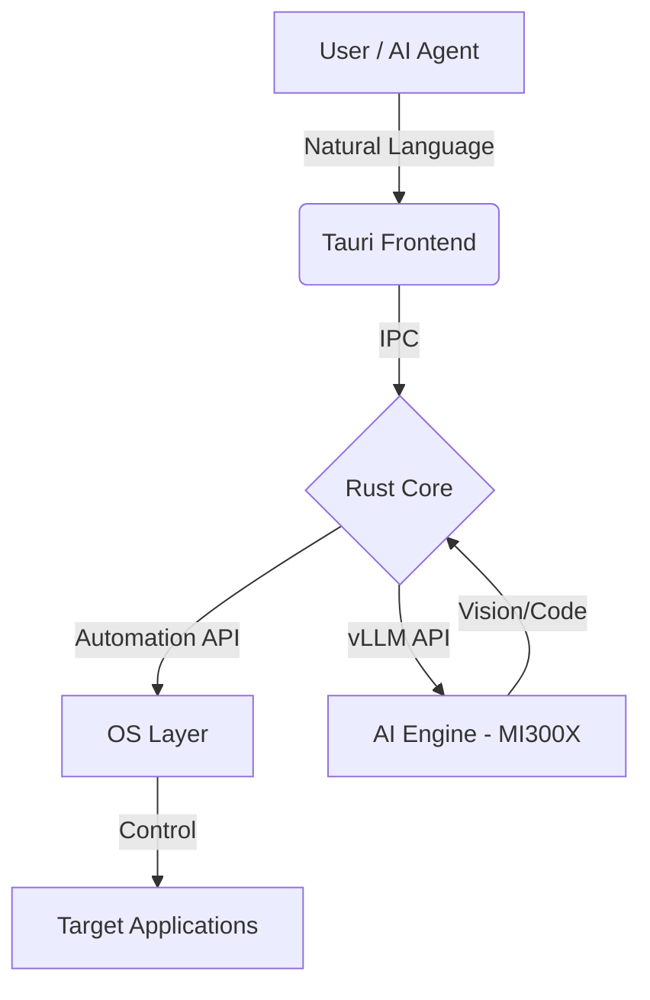

# 🐾 Catog Automation

### The AI-First Desktop Orchestration Framework


> [!IMPORTANT]
> **Catog Automation** is a high-performance, cross-platform desktop automation system built with Rust and Tauri. It enables autonomous AI agents to interact with any application through natural language, visual grounding, and direct system manipulation.

---

## 🚀 Key Features

### 🧠 Autonomous Orchestration
- **Visual Grounding**: Integrates with Vision models (Qwen-VL) to "see" and interpret GUI elements in real-time.
- **Natural Language Control**: Parse complex human intents into multi-step automation sequences.


### 🎮 Precision Control
- **Input Simulation**: Pixel-perfect mouse movements and keyboard automation with human-like jitter and delays.
- **Window Management**: Complete control over window state, dimensions, and positioning across multiple displays.
- **UI Automation**: Native integration with macOS Accessibility API (Windows UI Automation and Linux AT-SPI support coming soon).

### ⚡ Performance Optimized
- **AMD MI300X Native**: Deeply optimized for AMD MI300X GPUs using ROCm and vLLM.
- **MTP Speculative Decoding**: Extreme inference speeds for real-time agentic responses.
- **Low Latency**: Built with Rust for near-zero overhead system interactions.

---

## 🏗️ Architecture



---

## 🛠️ Getting Started

### Prerequisites
- **OS**: macOS 13+ (Windows and Linux support in development)
- **Rust**: 1.75+
- **Node.js**: 20+
- **Hardware**: Recommended NVIDIA or AMD GPU for local inference (Optimized for MI300X)

### Installation

1. **Clone the repository**
   ```bash
   git clone https://github.com/yourusername/catog-automation.git
   cd catog-automation/MainSoftware/catog-automation
   ```

2. **Install dependencies**
   ```bash
   npm install
   ```

3. **Start Development Mode**
   ```bash
   npm run tauri dev
   ```

---

## 🤖 AI Backend Setup (AMD MI300X Optimized)

Catog Automation is designed for extreme-speed dual-model orchestration. Use the following optimized deployment script to launch your backend:

```bash
#!/bin/bash

# --- Global Optimizations for MI300X (192GB VRAM) ---
export HF_TOKEN="<YOUR_HF_ACCESS_TOKEN>"
export VLLM_SLEEP_WHEN_IDLE=1
export VLLM_USE_DEEP_GEMM=0
export VLLM_USE_FLASHINFER_MOE_FP16=1
export VLLM_USE_FLASHINFER_SAMPLER=0
export VLLM_ROCM_USE_AITER=1
export VLLM_ROCM_USE_AITER_FP4BMM=0 
export HIP_FORCE_DEV_KERNARG=1
export OMP_NUM_THREADS=4

# --- OS Level Tweaks ---
# Disable NUMA balancing to prevent latency spikes in real-time loops
# sudo sysctl -w kernel.numa_balancing=0

echo "Starting Real-Time Vision Assistant on Port 8000..."
# --- Instance 1: Vision Assistant (Real-Time GUI Grounding) ---
# Utilizing 0.15 (~28.8GB VRAM)
OMP_NUM_THREADS=1 vllm serve Qwen/Qwen3-VL-2B-Instruct \
    --host 0.0.0.0 \
    --port 8000 \
    --dtype bfloat16 \
    --gpu-memory-utilization 0.15 \
    --max-model-len 16384 \
    --kv-cache-dtype fp8 \
    --limit-mm-per-prompt '{"image": 2}' \
    --mm-processor-cache-gb 4 \
    --trust-remote-code &

# Wait for vision model to initialize before starting the heavy coder
sleep 30

echo "Starting Extreme Speed Coder on Port 30000..."
# --- Instance 2: Extreme Speed Coding Flagship ---
# Utilizing 0.75 (~144GB VRAM) | Total VRAM usage: 90%
vllm serve amd/Qwen3.5-35B-A3B-MXFP4 \
    --host 0.0.0.0 \
    --port 30000 \
    --quantization quark \
    --gpu-memory-utilization 0.75 \
    --max-model-len 32768 \
    --tensor-parallel-size 1 \
    --enable-expert-parallel \
    --enable-prefix-caching \
    --enable-auto-tool-choice \
    --tool-call-parser qwen3_coder \
    --reasoning-parser qwen3 \
    --kv-cache-dtype fp8 \
    --enable-chunked-prefill \
    --trust-remote-code
```

---

## 🔗 Integrations

Catog Automation proudly integrates and builds upon the foundations of several leading automation projects:

- **Codex**: Orchestration logic and advanced reasoning modules.
- **Desktop Commander**: High-precision desktop control interfaces and OS abstractions.
- **MCP Chrome**: Seamless browser automation via the Model Context Protocol.

---

## 🛡️ Security & Safety

- **Audit Logging**: Every action taken by the agent is logged with timestamps and screenshots.
- **App Whitelisting**: Restrict the agent to specific applications (e.g., Chrome, VS Code).
- **Manual Confirmation**: Optional "Human-in-the-loop" mode for sensitive actions.

---

## 📄 License

This project is licensed under the MIT License - see the [LICENSE](LICENSE) file for details.

---

<p align="center">
  Built with ❤️ by the Catog Team
</p>
